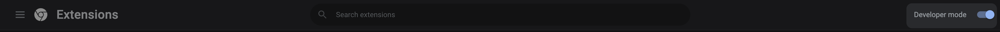

# Mark Reviews Spam

## How to load the extension?

### Download Chrome Extension
* Take a clone of this repo
```bash
git clone https://github.com/Smooth-Code-IO/mark-app-review-spam-extension.git
```
OR
* Download the Chrome Extension from [here](https://shorturl.at/bxPQ6)
* Unzip the extension

### Load extension in Google Chrome
* Open Google Chrome
* Navigate to `chrome://extensions/`
* Turn on the **Developer Mode**


* Click on **Load unpacked**


* Navigate to where the repo was cloned and select the `smoothcode-chrome-extension` folder

**Your extension should be loaded!**

## Platform
* Once the extension is installed, you can navigate to `https://apps.shopify.com/<your-app-name>/reviews`
* You will be redirected to `https://hacks.smoothcode.io/reviews/login`
* If you're already signed up, Login to the platform


* If not, sign up on the platform using the **Signup** button on the top right
* Once you're logged in, [Add your application to the platform](https://smooth-code.notion.site/How-to-Add-Application-on-Spam-Reviews-Analyser-7c34e0c722df4590b34aefb985c50e55)
* Once your application is added, close the tab.
* Navigate back to `https://apps.shopify.com/<your-app-name>/reviews`
* You should be able to see **Mark as Spam** button with every review


All the reviews you mark as spam will be visible on the dashboard: `https://hacks.smoothcode.io/reviews/home`

For any queries, feel free to contact us at: `hello@smoothcode.io`

***
Powered By [SmoothCode](https://www.smoothcode.io)
***